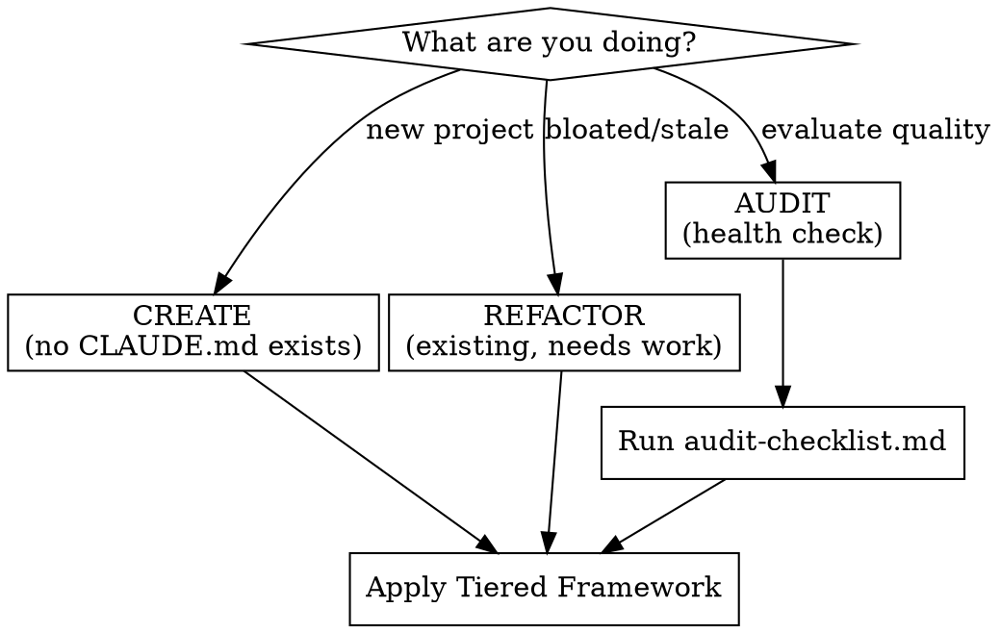

# Writing CLAUDE.md

## Overview

A CLAUDE.md file is a launchpad, not a knowledge dump. Every instruction must earn its place by applying to most tasks in the repo.

**Violating the letter of the rules is violating the spirit of the rules.** "It might be relevant" is not "it applies to most tasks."

## When to Use

- New project needs a CLAUDE.md
- Existing CLAUDE.md is bloated, stale, or agents ignore it
- User asks to evaluate or health-check their instruction files
- Agent behavior suggests missing or conflicting instructions

**When NOT to use:** Project-specific conventions that don't generalize — put those directly in the CLAUDE.md itself.

## Mode Routing



## The Tiered Framework

### Tier 1 — Always in root

- **One-sentence project description** — anchors every decision
- **Package manager** — if not npm (or use corepack)
- **Build, test, lint, typecheck commands** — agents need these constantly
- **CI/deployment gotchas** — things that break in non-obvious ways

### Tier 2 — The "before opening a file" test

> "Would an agent need this before it knows which file to open?"

**Yes → root:** Domain terminology, key architectural decisions, cross-cutting constraints.

**Depends on task → separate file, referenced from root:** TypeScript conventions, testing patterns, API design rules.

### Tier 3 — Never in root

- **File paths** — they change; let the agent discover
- **Style rules** — linter config, not prose
- **Code patterns / examples** — separate file
- **Linter-enforceable rules** — automate, don't document
- **Obvious guidance** — "write clean code" (delete)
- **Onboarding material** — CLAUDE.md is for agents, not humans

## File Hierarchy

```
~/.claude/CLAUDE.md       → Personal prefs (all projects)
project/CLAUDE.md         → Team conventions (committed to git)
project/src/CLAUDE.md     → Subdirectory (loaded when working in src/)
```

**Common mistake:** Personal preferences in project root get committed and imposed on the whole team. Move to `~/.claude/CLAUDE.md`.

## Progressive Disclosure

Split when a category is genuinely independent and exceeds ~30 lines. Don't split 2-3 rules into their own file. Reference from root: `For testing patterns, see docs/TESTING.md`

**Monorepos:** Root gets purpose + shared tooling. Package-level gets package-specific stack and conventions.

## Create Mode

1. One-sentence project description
2. Package manager (if not npm)
3. Build/test/lint commands (if non-standard)
4. Apply "before opening a file" test to any other candidates
5. **Stop.** Add guidance only when the agent demonstrably fails

## Refactor Mode

1. Read the entire file
2. Identify contradictions — ask user which to keep
3. Sort every instruction into Tier 1 / 2 / 3
4. Tier 1 stays. Tier 2: apply "before opening a file" test. Tier 3: move out or delete.
5. Create progressive disclosure references from root
6. Flag obvious/redundant instructions for deletion (confirm with user)

## Audit Mode

**REQUIRED:** Run `audit-checklist.md`, then present a prioritized report. Work through fixes conversationally, starting with errors.

## Red Flags — STOP

- Adding a rule because the agent failed once (reactive accumulation)
- Documenting specific file paths (`src/auth/handlers.ts`)
- Style rules as prose instead of linter config
- File exceeds 100 lines without progressive disclosure
- Documenting what the agent can discover from code or git history

## Common Mistakes & Rationalizations

| Mistake / Excuse | Fix |
|------------------|-----|
| "More context is always better" | Irrelevant context dilutes important instructions |
| "It might be relevant someday" | Move it out — progressive disclosure exists for this |
| "I'll clean it up later" | Later never comes. Apply the tiered framework now |
| "The agent needs to know our style" | Configure your linter. That's what linters are for |
| "I'll just add this one thing" | This is how every bloated CLAUDE.md started |
| Personal prefs in project root | Move to `~/.claude/CLAUDE.md` |
| Contradictory rules from multiple devs | Audit for contradictions, resolve with team |
| Stale references to moved/renamed files | Prefer capability descriptions over file paths |
| Over-fragmenting into tiny files | Only split when independent and >30 lines |
